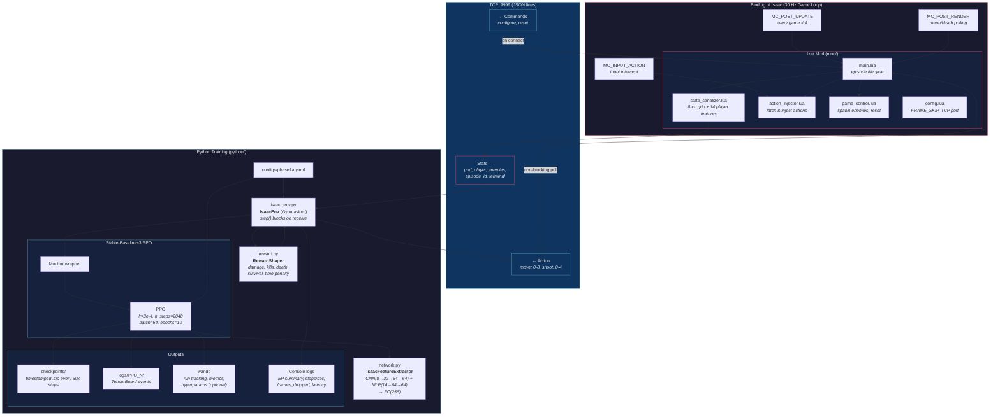

# System Architecture

Binding of Isaac RL training loop — Lua mod communicates with Python PPO trainer over TCP.

## Key Dynamics

- **Lua owns the clock**: `MC_POST_UPDATE` fires at 30 Hz. State is serialized and pushed over TCP every `FRAME_SKIP` ticks.
- **Python blocks, Lua doesn't**: `step()` blocks on `_receive()`, but Lua's `pollAction()` is non-blocking (timeout=0). If Python is slow, Lua re-applies the last latched action.
- **Fire-and-forget actions**: Python sends actions without waiting for confirmation. Lua drains all buffered messages and latches the latest.
- **Episode sync via `episode_id`**: Lua increments on restart, Python spins in `_wait_for_new_episode()` until it sees a new ID.
- **Frame drop detection**: `episode_tick` (sent by Lua) lets Python detect gaps where states were missed.
